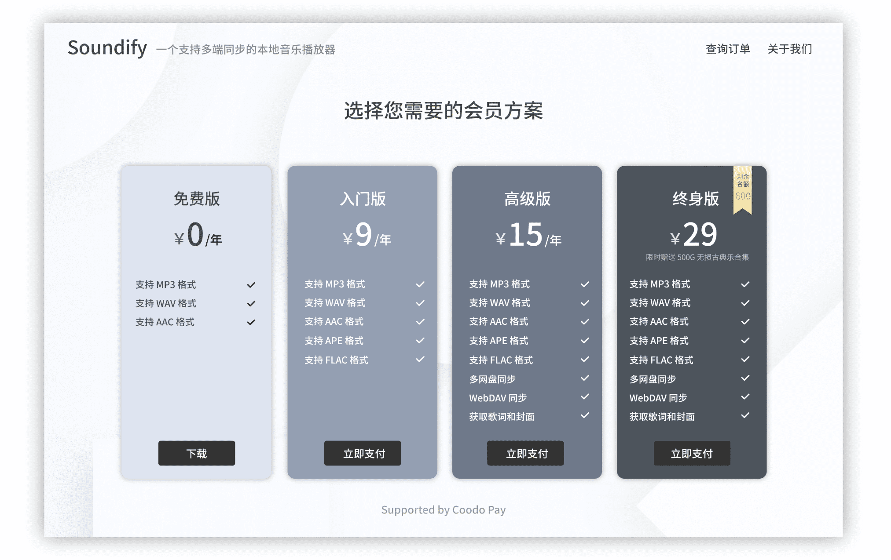
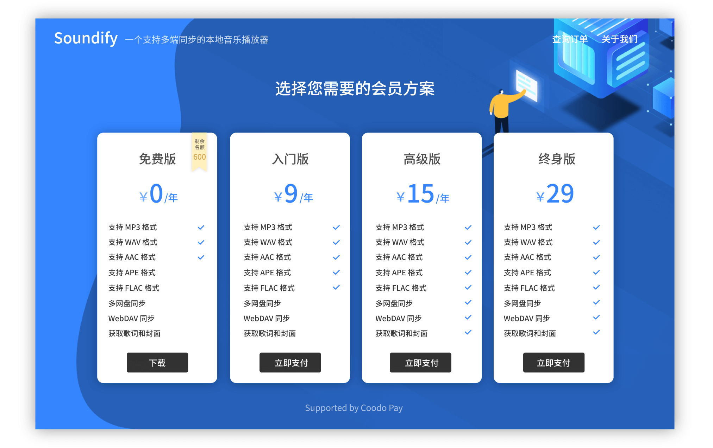

<div align="center">

</div>
  <h1 align="center">
    Memberly
  </h1>
  <h3 align="center">
    Help you run your own subscription services
  </h3>
  <h4 align="center">
    Memberly is now open for registration, it's completely free😘 
  </h4>
<div align="center">

[Demo](https://app.memberly.vip/#/product/60608503d5dc6641efdeb0f7) | [Register](https://app.memberly.vip/#/install) | [Documentation](https://www.notion.so/troyeguo/8872c44d7fda431e9aed67a6d6affaa3?v=4aa8d73d2d834ac8868f7b29e80fb0eb)

</div>

<hr>


<hr>

## Introduction

- Support for Alipay and Paypal.
- Email notification and order-query system
- Built-in customer management system
- Integration with Wechat and Telegram
- Marketing tool to boost your bussiness
- 10 website themes adapted to all modern browsers and mobile devices

## Live Preview

[Product page](https://app.memberly.vip/#/product/60608503d5dc6641efdeb0f7)

[Manage system](https://app.memberly.vip)

## Frontend technologies stack

- React (with hooks)
- React Router
- React Redux
- Ant Design
- ...

## Backend technologies stack

- Koa2
- Mongodb
- PM2
- JSON Web Token
- NodeMailer
- WebSocket
- ...

## Installation

```
  # 1. Clone the Memberly repository
  https://github.com/troyeguo/memberly.git

  # 2. Enter directory
  cd memberly

  # 3. Initialize and clone attached submodules for client and server
  git submodule init && git submodule update

```
